## Project Description
The goal of this project was to design the interface for a smart device.

Our group chose to design a smart shower.
Our smart shower has exact temperature and pressure control along with a remaining hot water display.

We also simulated a depletable hot water tank.
If the hot water runs out then temperature of the shower will slowly deplete.

## Design Work

### Needs Gathering

#### Affordances
Because our object is a shower it does not move.
It affords a large surface area that can be used for a UI.
Users will be standing and should have at least one hand free.

#### Interviews

Our findings were that:
 - Adjusting the temperature is a pain point
 - Desire to change water pressure
 - Listening to music in the shower could be easier and sound better
 - Time tracking isn't a paint point
 - Our smart shower should support many users
 - There might be some benift to hot water tank tracking

***Each time you take a shower, do you find yourself adjusting the shower head or the temperature to the same position/temperature?***

*Yes*

***Do you share a shower with multiple people? If so, how does this impact your shower experience (lack of hot water?, changed shower head position or flow type?)***

*Yes, and no impact - water pressure in the whole house is terrible, that’s the big issue*

***Do you often lose track of time in the shower, or find yourself taking too long of showers? (Shower duration tracker)***

*No, I’m always rushing*

***Are you satisfied with the water pressure of your shower?***

*No but it’s a deeper problem*

***Do you listen to music in the shower? If so, how?***

*No, Im not technologically capable*

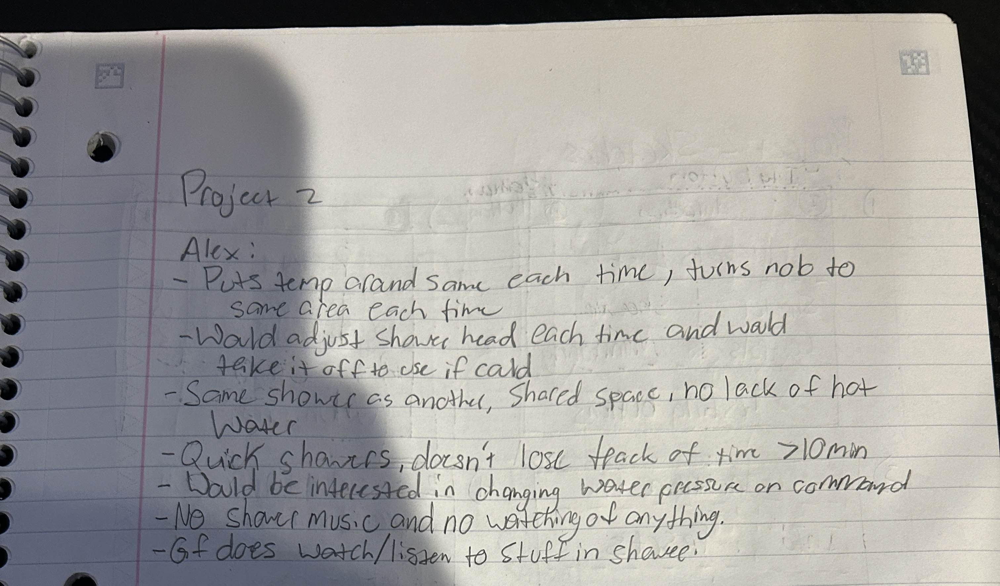

***Each time you take a shower, do you find yourself adjusting the shower head or the temperature to the same position/temperature?***

*Sure, I always put it to the same spot before getting in and wait around for it to heat up.*

***Do you share a shower with multiple people? If so, how does this impact your shower experience (lack of hot water?, changed shower head position or flow type?)***

*Our shower head doesn't have settings or anything like that. I don't like waiting on *redacted* but we only run out of hot water if someone is running the washing machine.*

***Do you often lose track of time in the shower, or find yourself taking too long of showers? (Shower duration tracker)***

*I only take showers in the morning and I'm pretty quick.*

***Are you satisfied with the water pressure of your shower?***

*It's fine.*

***Do you listen to music in the shower? If so, how?***

*I've left my phone on the sink before but it's not great but most of the time I'm just trying to take a shower.*

#### Assumptions

The smart shower can output the desired temperature of the user instantly without any warmup.
The water pressure can be changed on the fly.
Shower still depends on a depleteable water tank which it can sense the level of.

#### User Needs and Design Requirements

 - Many profiles for each user that save temperature and pressure
 - Controllable and displayed temperature and pressure
 - Media player with controls
 - Hot water tank tracking

### Sketching

#### Design Alternatives
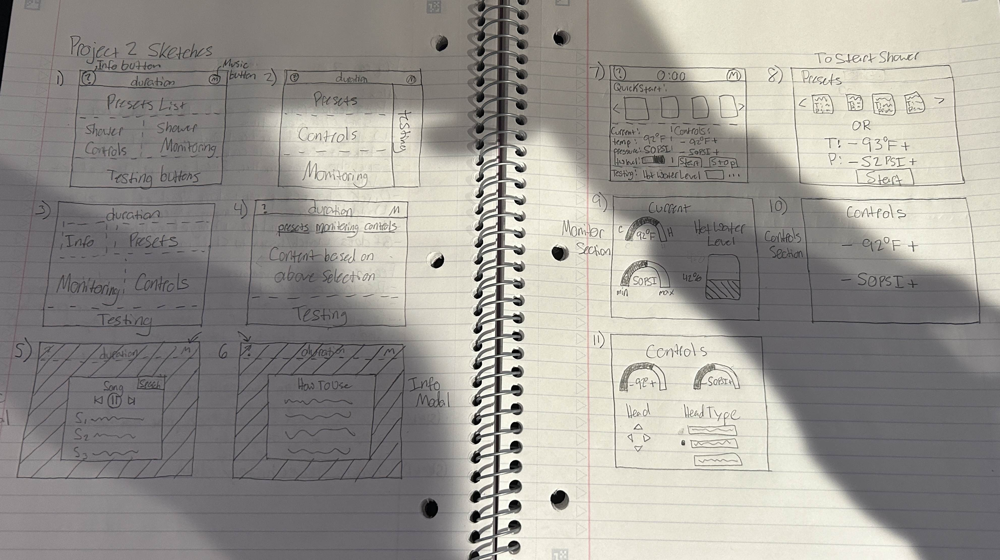

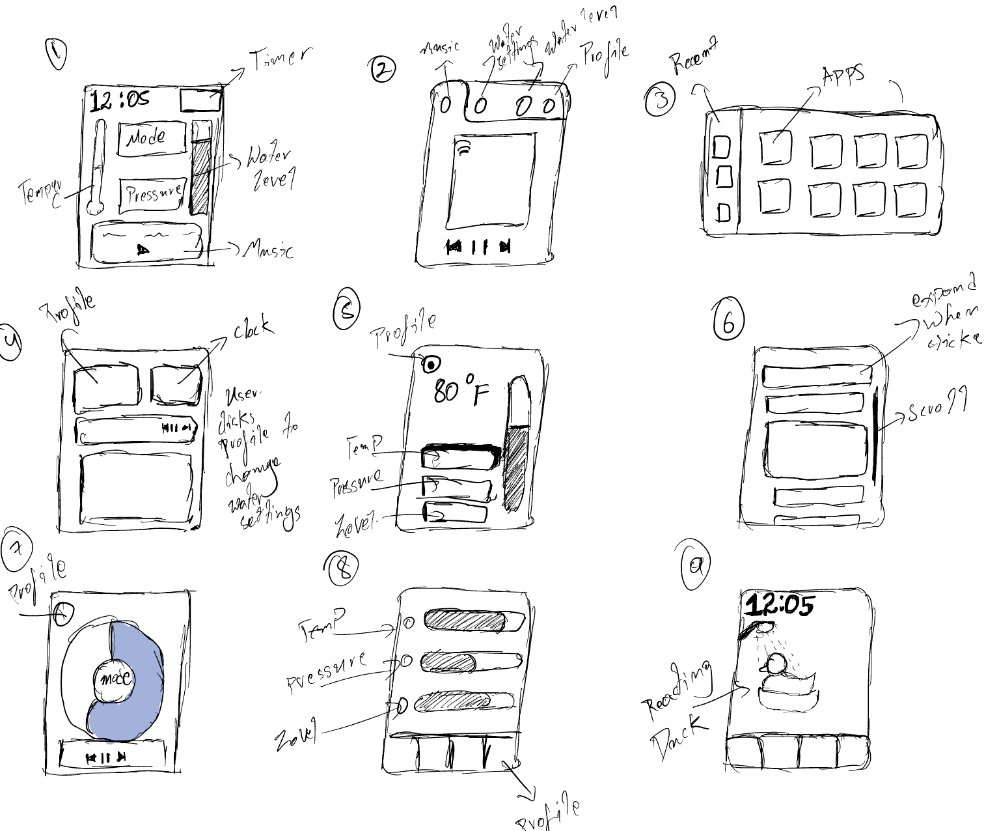

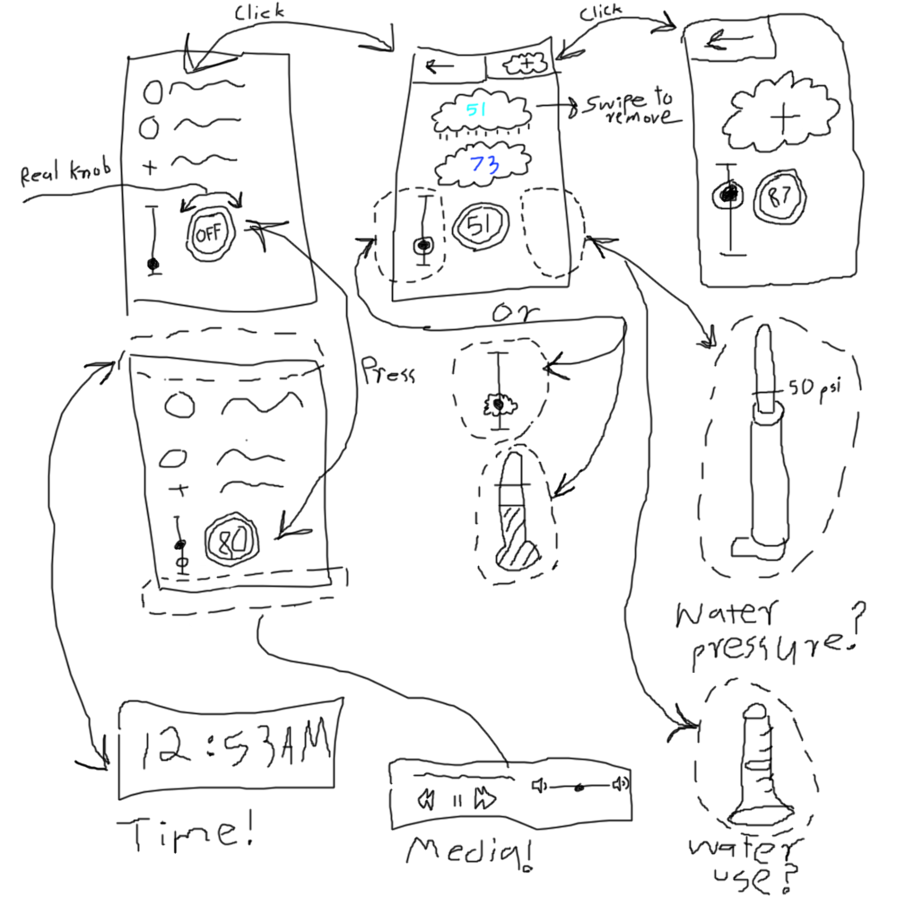

#### Vanilla Sketch
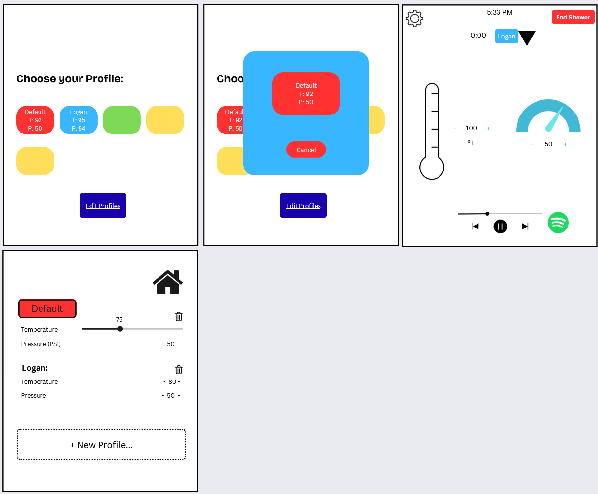

### Storyboard + Hybrid Sketch
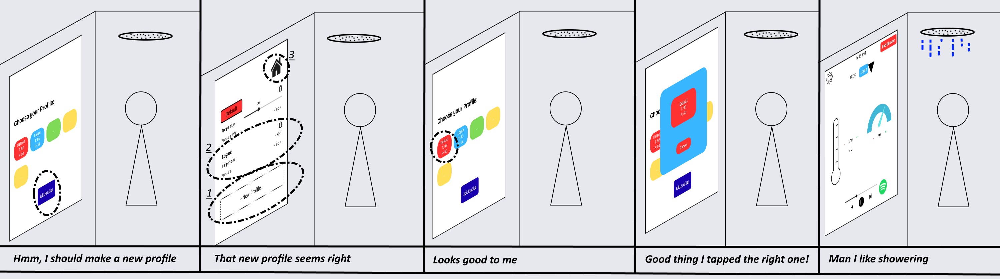

### User Feedback

## Summarized Feedback
 - Users like the profile selection page and appreciate the countdown before a shower starts
 - Users would rather drag the temperature pressure controls than use plus and minus buttons
 - Despite not having a label the current shower duration timer was understood and appreciated
 - Users liked the idea of being able to swtich to another profile mid shower

## Feedback From Users
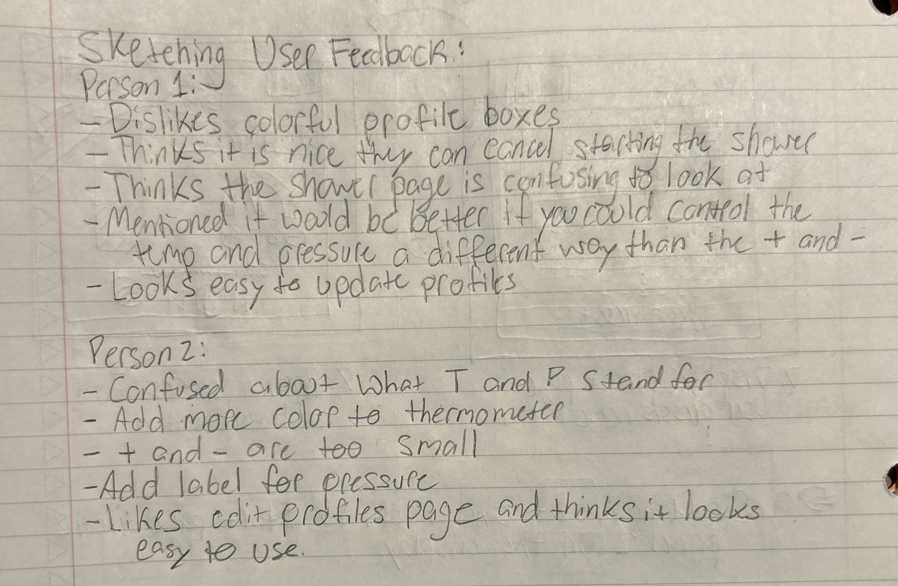

## User Interface
First, the interface was designed for a 640x854 resolution.
The main interface is touch screen without any physical knobs or dials.
It is important to note that the device is so smart that it does not need to warmup.

### Select Profile Page
A shower beings by a user selecting a profile they they have previously created.
They can also edit or create a new profile before their shower.
There is a 5 second countdown before starting the water that can be cancled.

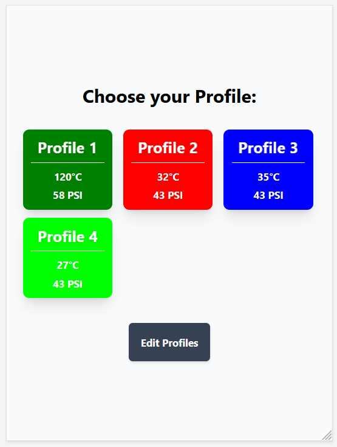

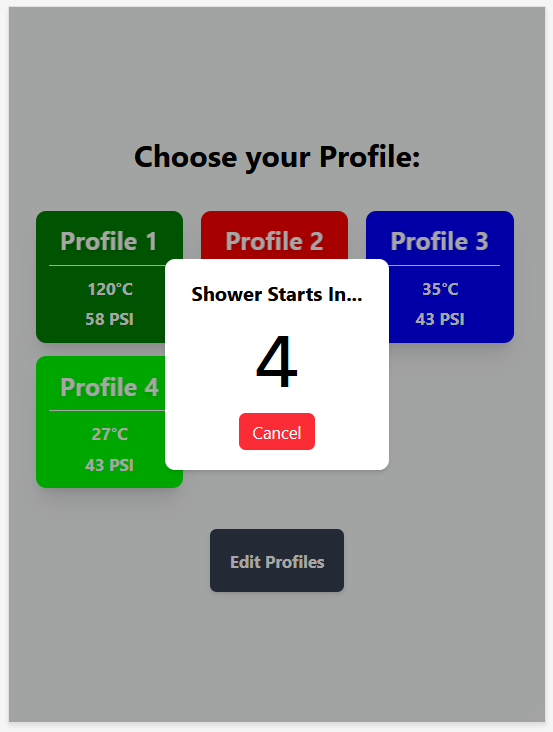

### Shower Page
There are two parts to the shower UI, the real shower UI and the testing UI.
The testing UI is located at the bottom of the screen and would not appear on the real device.

After the shower has begun, the pressure and temperature can be changed.
A user drags a thermometer and pressure gauge to select the temperature and pressure they desire.

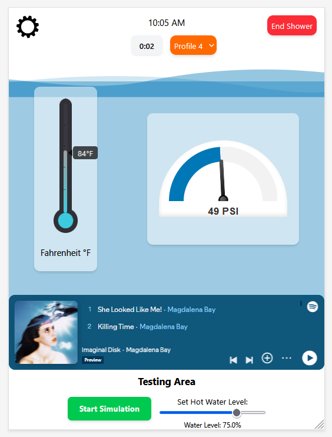

They can also swtich to another profile by tapping the current profile.

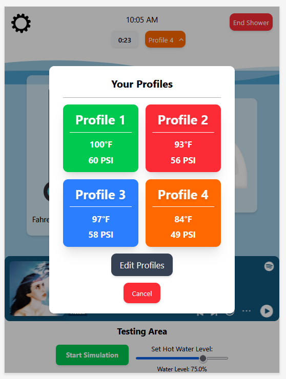

The testing UI is used to simulate depleting hot water.

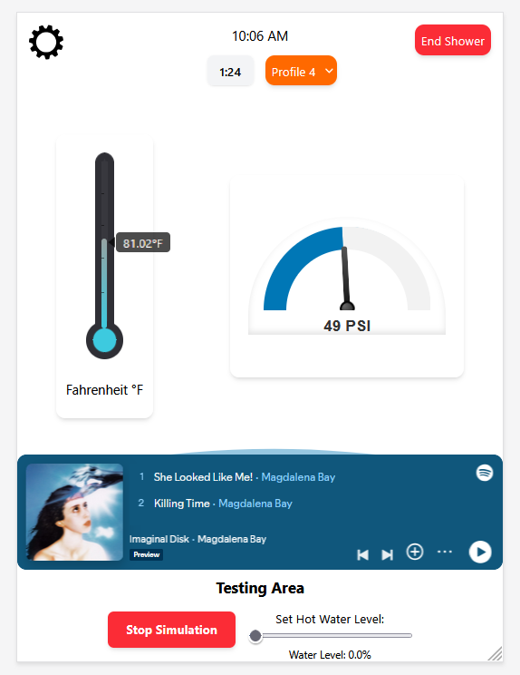

There is also the settings popup that has been left as future work.

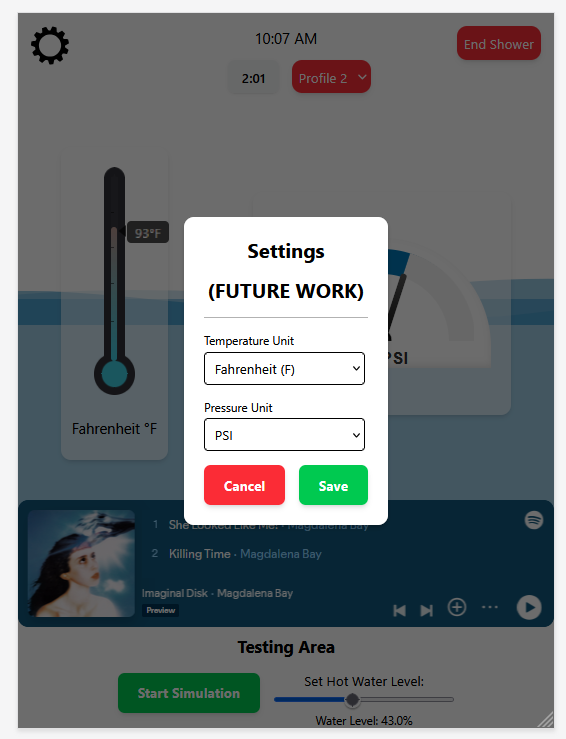

### Edit Profiles Page
A user can change the temperature, pressure, and color of a profile or delete it.
The profile color is change via tapping the dropper to open the browsers color picker.
New profiles can also be created on this screen.

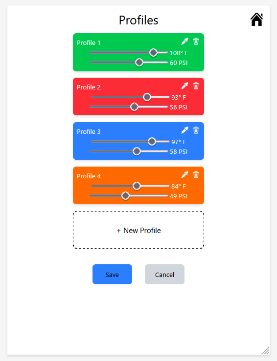

## Implementation
This is a multipage svelte kit project.
State is presisted using `localStorage` to store a json object.
There are various svelte components that are reused across the app.
Tailwind is used heavly with very little actual css.
We hosted this project on vercel.

## Future Work
Changing the units on the settings page should actually update all units on the app.
This was left as future work to leave more time to work on the actual UI.

## Video
[Video](https://www.youtube.com/watch?v=6TSah24AGwA)

## Code
[https://github.com/as7erism/smart-shower](https://github.com/as7erism/smart-shower)

